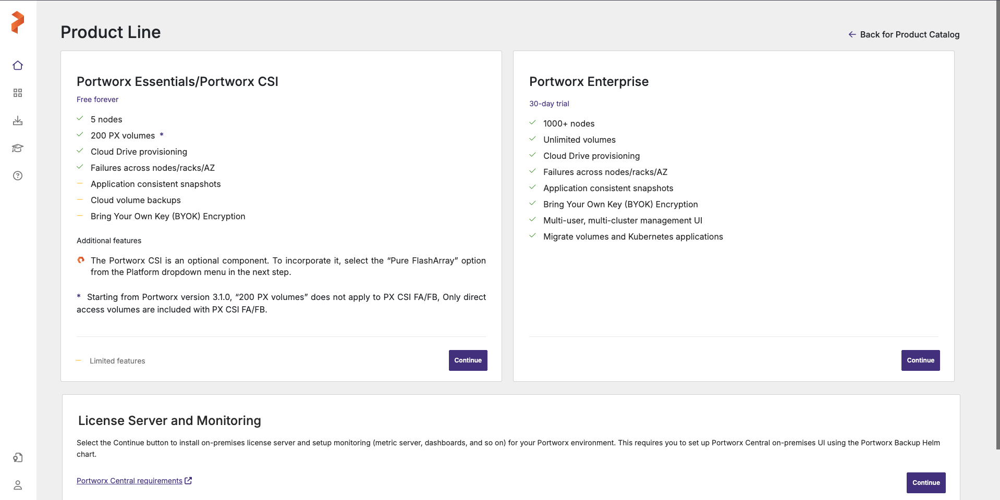
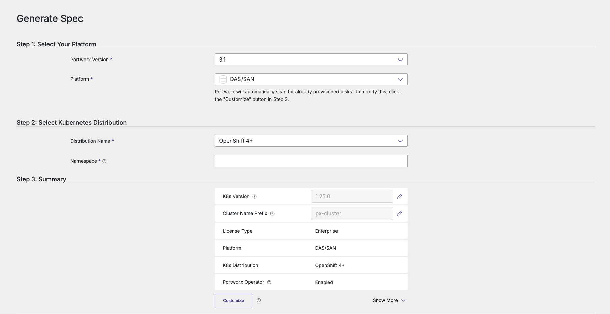
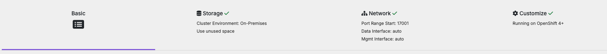

# Install Portworx on air-gapped bare metal OpenShift cluster

Follow the instructions to deploy Portworx and its required packages on air-gapped bare metal OpenShift cluster.

## Table of Contents

- [Prerequisites](#prerequisites)
- [Install Portworx](#install-portworx---steps)
    - [Whitelist images into air-gappd environment](#1-whitelist-images-into-air-gappd-environment)
    - [Create and whitelist Portworx configuration files](#2-create-and-whitelist-portworx-configuration-files)
    - [Push the images into the registry](#3-push-the-images-into-the-registry)
    - [Create the Portworx cluster](#4-create-the-portworx-cluster)
    - [Verify Portworx cluster status](#5-verify-portworx-cluster-status)
- [Install Portworx with Helm](#install-portworx-with-helm---steps)
- [Uninstall Portworx](#uninstall-portworx)


## Prerequisites

* You must have a OpenShift cluster deployed on infrastructure that meets the minimum requirements for Portworx.
* You must also have a Linux host with internet access that has either Podman or Docker or installed.
* You must attach the backing storage disks to each worker node.
* You must have dedicated disk for internal kvdb.
* The KVDB device given above needs to be present only on 3 of your nodes and it should have a unique device name across all the KVDB nodes.
* Network:
    * Ports 17001 - 17020 opened for Portworx node to node communication
    * Ports 111, 2049, and 20048 opened for sharedv4 volumes support (NFSv3)
    * Port 2049 (NFS server) opened only if using sharedv4 services (NFSv4)

---

## Install Portworx - steps:

### 1. Whitelist images into air-gappd environment

1. Retrive your kubernetes version.
2. Retrive the desired portworx version.
3. On your internet-connected host run:

```bash
curl -o px-ag-install.sh -L "https://install.portworx.com/<PORTWORX VERSION>/air-gapped?kbver=<KUBERNETES VERSION>"
```

This action will retrive a script that we will use to pull all images neccassary for Portworx installation

4. Run the following command to pull all images locally on the linux host.

```bash
sh px-ag-install.sh pull
```

5.  After getting all images we will save them locally as .tar files

```bash
docker save -o <path for generated tar file> <image_name:version>
```

6. Whitelist all the images into the environment. 

**Note**: Make sure the versions of each image stays intact.


### 2. Create and whitelist Portworx configuration files

1. Create a version configmap - instructions for the Portworx from where to pull the images and in what version.

```bash
curl -o versions.yaml "https://install.portworx.com/<PORTWORX VERSION>/version?kbver=<KUBERNETES VERSION>"
```

**Importent Note**:

Portworx missed a few images so **add** the following image configurations if they are missing:

```
version: 3.1.6
components:
    ...
    kubeScheduler: custom-registry.org/k8s/kube-scheduler-amd64:v1.26.4
    kubeControllerManager: custom-registry.org/k8s/kube-controller-manager-amd64:v1.26.4
    pause: custom-registry.org/k8s/pause:3.1
```


**Replace all the default registrys for each image with your registry while keeping the subfoldering the same**


2. On your internet-connected host go to [Portworx Central](https://central.portworx.com/):

After login select the **Portworx Enterprise** plan:




Then start generating you spec:



**Portworx Version**  : Select the desired Portworx version
**Platform**          : DAS/SAN
**Distribution Name** : OpenShift 4+
**Namespace**         : kube-system
....

Continue customizing your Portworx cluster.

##### Customization Notes:



- **Basic Section**: Enter the appropriate versions and specify the namespace.
- **Storage Section**: To allocate a dedicated disk for KVDB, uncheck **Skip KVDB Device** and select your preferred KVDB device.
- **Network Section**: Optionally, select a dedicated network interface for data transfer and management.
- **Customize Section**:
  - Under **Customize**: Choose **OpenShift 4+** and add a pull secret name for the images if required.
  - Under **Registry and Image Settings**: If you are not using subfolders for image organization in the registry, specify the static registry path for all images and add the pull secret name.
  - Under **Advanced Settings**: Disable **Telemetry** and enable **Monitoring**.

Example for genarated [storagecluster](../conf_files/yamls/storagecluster.yaml)


3. Genarate the operator

```bash
curl -o operator.yaml "https://install.portworx.com/<PORTWORX VERSION>?comp=pxoperator&reg=<CUSTOM REGISTRY PREFIX>"
```

4. Whitelist the previously created files:

    1. storagecluster.yaml
    2. operator.yaml
    3. versions.yaml

### 3. Push the images into the registry

1. Gather all the .tar files (images).

2. Load the back into docker/podman

```bash
docker load -i <path_to_image_tar_file>
```

3. Tag and Push them into the registry with the same name and version.

```bash
docker login
docker tag <loaded_image_name> your-registry/path_to_image/name_of_the_image:image_version
docker push <tagged_image_name>
```

Note: For a link to a script that can be used to automate the process, press [here](../conf_files/)

### 4. Create the Portworx cluster

1. Create a configmap from the versions file

```bash
oc -n kube-system create configmap px-versions --from-file=versions.yaml
```

2. Apply the operator file

```bash
oc apply -f operator.yaml
```

3. Apply the storagecluster file

```bash
oc apply -f storagecluster.yaml
```

### 5. Verify Portworx cluster status

1. Make sure all the pods are in a running state (may take up to 15 minutes)

```bash
watch kubectl get pods -n kube-system | grep -e portworx -e px
```

2. Verify Portworx status

```bash
kubectl exec <px-cluster-pod-name> -n kube-system -- /opt/pwx/bin/pxctl status
```

3. Verify pxctl cluster provision status

* Make sure the status of the storage cluster is Running
```bash
kubectl -n kube-system get storagecluster
```
* Make sure the status of the storage nodes is Online
```bash
kubectl -n kube-system get storagenodes
```


### Additional Resources
* [Portworx on bare metal air-gapped Kubernetes cluster](https://docs.portworx.com/portworx-enterprise/platform/kubernetes/bare-metal/airgapped-baremetal/install)
* [Portworx on air-gapped OpenShift on vSphere](https://docs.portworx.com/portworx-enterprise/platform/openshift/ocp-vsphere/install/ocp-vsphere-airgapped)

---

## Install Portworx with Helm - steps:

### Additional Resources
* [Portworx Helm Chart](https://github.com/portworx/helm/tree/master/charts/portworx)

---

## Uninstall Portworx:

1. Delete the storage cluster

```bash
oc -n kube-system delete stc <storagecluster_name>
```

**Note**: Wait for the deletation of all the components.

2. Delete the storage cluster

```bash
oc delete -f operator.yaml
```

3. Delete the versions file

```bash
oc -n kube-system delete configmap px-versions
```

### Additional Resources
* [Uninstall Portworx Cluster](https://docs.portworx.com/portworx-enterprise/platform/kubernetes/bare-metal/airgapped-baremetal/uninstall/uninstall-operator)

---